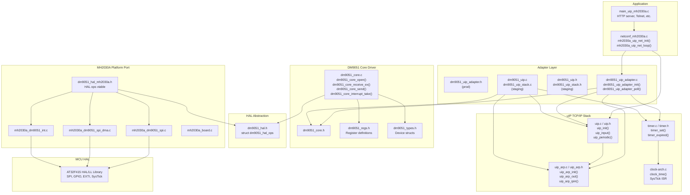
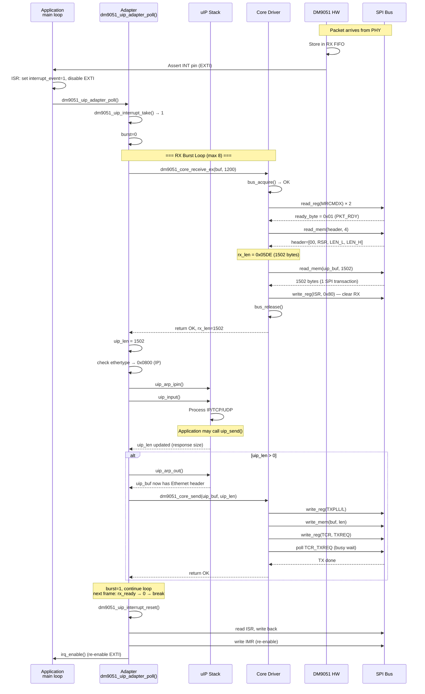
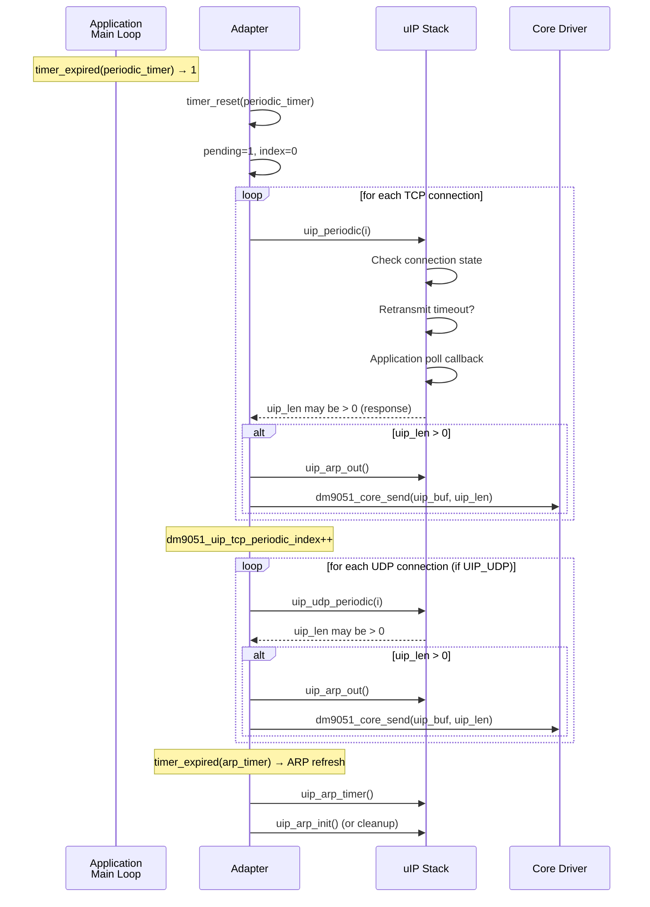
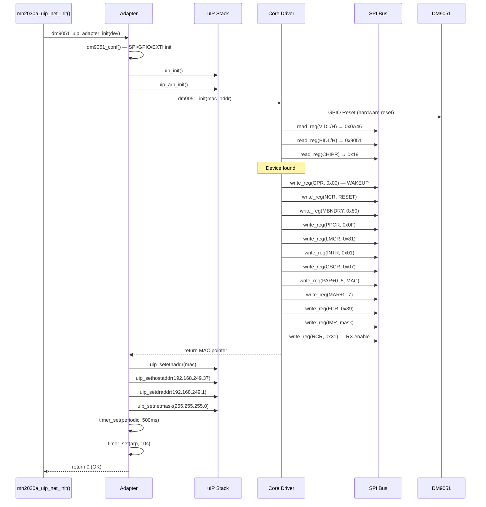

# DM9051 uIP Adapter Layer 深度分析

> **專案**: MH2030_Demo  
> **目錄**: `ModuleDemo/DM9051A/dm9051_driver/adapters/uip/`  
> **參考實作**: `ModuleDemo/DM9051A/port/uip/`  
> **MCU**: AT32F415 (ARM Cortex-M4)  
> **Ethernet**: DM9051 (SPI 介面)  
> **TCP/IP Stack**: uIP 1.0  
> **RTOS**: Bare-metal (無 RTOS)

---

## 1. 架構總覽

```
┌──────────────────────────────────────────────────────────────────┐
│                     Application Layer                            │
│  (main_uip_mh2030a.c, netconf_mh2030a.c, user app callbacks)    │
└──────────────────────────┬───────────────────────────────────────┘
                           │
┌──────────────────────────▼───────────────────────────────────────┐
│                     uIP TCP/IP Stack                             │
│  (middlewares/3rd_party/uip/)                                    │
│  uip_init(), uip_input(), uip_periodic(), uip_udp_periodic()    │
│  uip_arp_init(), uip_arp_out(), uip_arp_ipin(), uip_arp_arpin() │
│  Global: uip_buf[], uip_len, uip_appdata, uip_ethaddr           │
└──────────────────────────┬───────────────────────────────────────┘
                           │
┌──────────────────────────▼───────────────────────────────────────┐
│                   Adapter Layer (Glue Code)                       │
│                                                                   │
│  ┌─────────────────────┐  ┌───────────────────────────────────┐  │
│  │ adapters/uip/       │  │ port/uip/                         │  │
│  │ [Staging - 新版]    │  │ [Production - 目前生產版本]        │  │
│  │                     │  │                                   │  │
│  │ dm9051_uip.h        │  │ dm9051_uip_adapter.h              │  │
│  │ dm9051_uip.c        │  │ dm9051_uip_adapter.c              │  │
│  │ dm9051_uip_stack.h  │  │ netconf_mh2030a.h/.c              │  │
│  │ dm9051_uip_stack.c  │  │ clock-arch.h/.c                   │  │
│  └─────────────────────┘  └───────────────────────────────────┘  │
└──────────────────────────┬───────────────────────────────────────┘
                           │
┌──────────────────────────▼───────────────────────────────────────┐
│                    DM9051 Core Driver                            │
│  (core/src/dm9051_core.c, core/inc/dm9051_core.h)               │
│  dm9051_core_open(), dm9051_core_receive_ex(),                  │
│  dm9051_core_send(), dm9051_core_interrupt_take(), ...          │
└──────────────────────────┬───────────────────────────────────────┘
                           │
┌──────────────────────────▼───────────────────────────────────────┐
│                    HAL Abstraction Layer                         │
│  (hal/inc/dm9051_hal.h)                                          │
│  struct dm9051_hal_ops { read_reg, write_reg, read_mem,         │
│    write_mem, reset, delay_ms, delay_us,                         │
│    irq_enable, irq_disable, enter_critical, exit_critical }     │
└──────────────────────────┬───────────────────────────────────────┘
                           │
┌──────────────────────────▼───────────────────────────────────────┐
│                    MH2030A Platform Port                          │
│  (port/mh2030a/)                                                 │
│  mh2030a_dm9051_spi.c        -- SPI polling implementation      │
│  mh2030a_dm9051_spi_dma.c    -- SPI DMA implementation          │
│  mh2030a_dm9051_int.c        -- EXTI/IRQ handling               │
│  dm9051_hal_mh2030a.h        -- HAL ops vtable binding          │
└──────────────────────────┬───────────────────────────────────────┘
                           │
┌──────────────────────────▼───────────────────────────────────────┐
│                    MCU HAL / SPI Peripheral                       │
│  (AT32F415 LL/HAL library)                                       │
└──────────────────────────────────────────────────────────────────┘
```

### 分層職責

| Layer | 職責 | 檔案位置 |
|-------|------|----------|
| **Application** | 網路應用邏輯, main loop | `apps/uip_dm9051_example_e1/` |
| **uIP Stack** | TCP/IP 協定處理, ARP, 重組 | `middlewares/3rd_party/uip/` |
| **Adapter** | 串接 uIP 與 DM9051 driver, RX/TX 排程 | `adapters/uip/` + `port/uip/` |
| **Core Driver** | DM9051 初始化, PHY 存取, RX/TX 流程 | `core/src/dm9051_core.c` |
| **HAL** | SPI register/memory 讀寫抽象介面 | `hal/inc/dm9051_hal.h` |
| **Platform Port** | MCU 專屬 SPI 實作, GPIO, EXTI | `port/mh2030a/` |

---

## 2. 目錄功能說明

### 2.1 `adapters/uip/` (新版 Staging Adapter)

| 檔案 | 功能 |
|------|------|
| `dm9051_uip.h` | Adapter public API header — 不依賴平台標頭 |
| `dm9051_uip.c` | Adapter 實作 — 包裝 `dm9051_core_*()` API |
| `dm9051_uip_stack.h` | Stack loop header — 提供 init + poll |
| `dm9051_uip_stack.c` | uIP stack 整合 loop — RX drain, periodic, ARP |

**設計目標**: 未來取代 `port/uip/dm9051_uip_adapter.c`。  
**當前狀態**: `staging` (`dm9051_uip_target_mode()` 回傳 `"staging"`)。

### 2.2 `port/uip/` (生產版本 Production Adapter)

| 檔案 | 功能 |
|------|------|
| `dm9051_uip_adapter.h` | 唯一對外 header, re-export `dm9051_netif.h` |
| `dm9051_uip_adapter.c` | 生產 adapter 實作 |
| `netconf_mh2030a.h` | 網路設定 (IP/GW/Mask 常數) |
| `netconf_mh2030a.c` | 初始化 + main loop 包裝 |
| `clock-arch.h` | uIP clock port (`clock_time_t`, `CLOCK_SECOND`) |
| `clock-arch.c` | SysTick ISR + `clock_time()` |

---

## 3. 檔案用途分析

### 3.1 `dm9051_uip.h` — Adapter Public API

```c
// ====== Initialization ======
int dm9051_uip_init(const dm9051_netif_device_t *dev);
int dm9051_uip_attach(dm9051_device_t *dev);

// ====== RX ======
uint16_t dm9051_uip_input(uint8_t *buf, uint16_t buf_len);
int dm9051_uip_last_rx_status(void);

// ====== TX ======
int dm9051_uip_output(const uint8_t *buf, uint16_t len);

// ====== Interrupt / Polling ======
int dm9051_uip_interrupt_mode(void);
int dm9051_uip_interrupt_take(void);
void dm9051_uip_interrupt_reset(void);
void dm9051_uip_poll(void);

// ====== Diagnostic ======
const char *dm9051_uip_target_mode(void);
```

### 3.2 `dm9051_uip.c` — Internal State & Core Wrappers

```c
// Internal state
static dm9051_device_t *dm9051_uip_attached_dev;       // 綁定的 DM9051 device
static int dm9051_uip_last_rx_status_value;              // 最後一次 RX 狀態
```

### 3.3 `dm9051_uip_stack.c` — uIP Stack Integration

```c
// Internal state (conditional on DM9051_UIP_ENABLE_PERIODIC)
static struct timer dm9051_uip_periodic_timer;           // 500ms TCP/UDP 週期計時器
static struct timer dm9051_uip_arp_timer;                 // 10s ARP 計時器
static uint8_t dm9051_uip_tcp_periodic_index;             // TCP periodic 輪詢索引
static uint8_t dm9051_uip_udp_periodic_index;             // UDP periodic 輪詢索引
static uint8_t dm9051_uip_tcp_periodic_pending;           // TCP pending flag
static uint8_t dm9051_uip_udp_periodic_pending;           // UDP pending flag
```

```c
// Internal (static) functions
static void dm9051_uip_stack_send_if_needed(void);        // 條件式 TX
static int  dm9051_uip_stack_drain_rx(void);              // RX burst drain
static uint8_t dm9051_uip_stack_rx_pending_from_burst(int); // 判斷是否還有 frame
static void dm9051_uip_stack_print_rx_burst(...);         // 診斷輸出
```

---

## 4. uIP API 對應

### Staging (`adapters/uip/dm9051_uip_stack.c`)

```c
// --- Init ---
dm9051_uip_stack_init()
  ├── dm9051_uip_init()           // 驗證 netif_device
  ├── uip_init()                  // uIP stack init
  ├── uip_arp_init()              // ARP table init
  ├── uip_setethaddr()            // 設定 MAC
  ├── uip_sethostaddr()           // 設定 IP
  ├── uip_setdraddr()             // 設定 Gateway
  ├── uip_setnetmask()            // 設定 Netmask
  └── timer_set() x2              // 啟動 periodic/ARP 計時器

// --- RX Path ---
uip_len = dm9051_uip_input(uip_buf, UIP_BUFSIZE)   // 從 DM9051 讀取 frame
  if ethertype == IP:
    uip_arp_ipin()                                    // ARP IP input processing
    uip_input()                                       // uIP TCP/IP input processing
    dm9051_uip_stack_send_if_needed()                 // TX if response ready
      ├── uip_arp_out()                               // ARP output (resolve MAC)
      └── dm9051_uip_output(uip_buf, uip_len)         // 寫入 DM9051 TX FIFO
  if ethertype == ARP:
    uip_arp_arpin()                                   // ARP packet processing
    dm9051_uip_output(uip_buf, uip_len)               // ARP reply

// --- TX Path ---
dm9051_uip_stack_send_if_needed()
  ├── uip_arp_out()               // ARP resolution + Ethernet header prepend
  └── dm9051_uip_output(uip_buf, uip_len)

// --- Periodic ---
dm9051_uip_stack_poll()
  ├── dm9051_uip_stack_drain_rx()  // RX burst (up to 8 frames)
  ├── uip_periodic(i)              // TCP periodic processing (per connection)
  ├── uip_udp_periodic(i)          // UDP periodic processing (per connection)
  └── uip_arp_timer()              // ARP cache cleanup (every 10s)
```

### Production (`port/uip/dm9051_uip_adapter.c`) — 對比

```c
// 生產版本的等價呼叫鏈:
dm9051_uip_adapter_init(dev)
  ├── dm9051_conf()               // SPI + IRQ 配置
  └── dm9051_netif_open(dev)
       ├── uip_init()
       ├── uip_arp_init()
       ├── dm9051_init(dev->mac_addr)
       ├── uip_setethaddr()
       ├── uip_sethostaddr()
       ├── uip_setdraddr()
       └── uip_setnetmask()

dm9051_uip_adapter_poll()
  // RX phase (與 staging 邏輯相同)
  // Periodic phase (與 staging 結構相同, 但沒有 burst pending 二次 drain)
```

### API Mapping Table

| uIP 角色 | Production API | Staging API | Core Driver API |
|----------|---------------|-------------|-----------------|
| Init | `dm9051_uip_adapter_init()` | `dm9051_uip_stack_init()` | `dm9051_core_open()` |
| RX frame | `dm9051_netif_input()` | `dm9051_uip_input()` | `dm9051_core_receive_ex()` |
| TX frame | `dm9051_netif_output()` | `dm9051_uip_output()` | `dm9051_core_send()` |
| IRQ check | `dm9051_interrupt_get()` | `dm9051_uip_interrupt_take()` | `dm9051_core_interrupt_take()` |
| IRQ reset | `dm9051_interrupt_reset()` | `dm9051_uip_interrupt_reset()` | `dm9051_core_interrupt_reset()` |
| Poll | `dm9051_uip_adapter_poll()` | `dm9051_uip_stack_poll()` | — |
| Mode | `dm9051_netif_target_mode()` | `dm9051_uip_target_mode()` | — |

---

## 5. DM9051 Driver API 對應

### Core Driver Public API (from `dm9051_core.h`)

```c
// Lifecycle
dm9051_core_default_config(config)
dm9051_core_config_is_valid(config)
dm9051_netif_device_is_valid(dev)
dm9051_core_open(dev, config, hal)
dm9051_core_close(dev)

// RX
dm9051_core_receive(dev, buf, buf_len)          // 簡化版, 回傳長度
dm9051_core_receive_ex(dev, buf, buf_len, len)  // 完整版, 回傳狀態 + 長度

// TX
dm9051_core_send(dev, buf, len)                  // 同步 TX (含 wait done)
dm9051_core_tx_poll_done(dev)                    // 非同步 TX 輪詢 (if !TX_WAIT_DONE)

// PHY
dm9051_core_phy_read(dev, reg)
dm9051_core_phy_write(dev, reg, value)
dm9051_core_link_is_up(dev)

// Interrupt
dm9051_core_interrupt_set(dev, irq_line)         // 從 ISR 呼叫
dm9051_core_interrupt_take(dev)                  // 檢查 + clear event flag
dm9051_core_interrupt_reset(dev)                 // 完整 IRQ 重設 (read ISR, write back, re-enable)

// Info
dm9051_core_mac(dev)
dm9051_core_device_found(dev)
dm9051_core_vendor_id(dev)
dm9051_core_product_id(dev)
dm9051_core_chip_revision(dev)
```

### Staging Adapter 對應關係

| Adapter API | Core Driver API | 備註 |
|-------------|----------------|------|
| `dm9051_uip_init(dev)` | `dm9051_netif_device_is_valid()` | 只驗證參數, 不操作硬體 |
| `dm9051_uip_attach(dev)` | 直接存 `dm9051_uip_attached_dev` | 保存 device pointer |
| `dm9051_uip_input(buf, len)` | `dm9051_core_receive_ex()` | 讀取 RX frame |
| `dm9051_uip_output(buf, len)` | `dm9051_core_send()` | 寫入 TX FIFO |
| `dm9051_uip_interrupt_take()` | `dm9051_core_interrupt_take()` | 取得 interrupt event flag |
| `dm9051_uip_interrupt_reset()` | `dm9051_core_interrupt_reset()` | 清除 ISR + re-enable IRQ |
| `dm9051_uip_poll()` | `dm9051_core_tx_poll_done()` | 非同步 TX 完成輪詢 |
| `dm9051_uip_interrupt_mode()` | 直接讀 `dev->runtime.config.interrupt_mode` | 返回 poll/interrupt mode |

---

## 6. RX/TX 資料流

### 6.1 RX 完整路徑

```
[Application Main Loop]
    │
    ├── mh2030a_uip_net_loop()
    │   └── dm9051_uip_adapter_poll()          [port/uip/dm9051_uip_adapter.c]
    │       │                                      (或 dm9051_uip_stack_poll() in staging)
    │       │
    │       ├── [Poll Mode]  直接進入 RX drain
    │       ├── [IRQ Mode]   dm9051_interrupt_get() / dm9051_uip_interrupt_take()
    │       │                 檢查 interrupt_event flag
    │       │
    │       └── dm9051_uip_stack_drain_rx()     ── 最多 8 frames per call
    │           │
    │           ├── dm9051_uip_input(uip_buf, UIP_BUFSIZE)
    │           │   └── dm9051_core_receive_ex(dev, uip_buf, UIP_BUFSIZE, &rx_len)
    │           │       ├── dm9051_core_bus_acquire(dev, hal)
    │           │       │   ├── enter_critical()
    │           │       │   ├── if bus_busy → return ERR_NOT_READY
    │           │       │   └── bus_busy = 1, exit_critical()
    │           │       │
    │           │       ├── dm9051_core_rx_ready(dev, &ready_byte)
    │           │       │   └── read_reg(hal, DM9051_MRCMDX) x2
    │           │       │       └── hal->ops->read_reg(ctx, reg, &val)
    │           │       │           └── [SPI Transaction: 0x70 | 0x00, read 1 byte]
    │           │       │
    │           │       ├── dm9051_core_rx_header(hal, header, &rx_len)
    │           │       │   └── read_mem(hal, header, 4)   ← 4-byte RX header
    │           │       │       └── hal->ops->read_mem(ctx, buf, len)
    │           │       │           └── [SPI Transaction: 0x72 | 0x00, read 4 bytes]
    │           │       │   header[0]: reserved
    │           │       │   header[1]: RSR (Rx Status Register)
    │           │       │   header[2]: RX length low byte
    │           │       │   header[3]: RX length high byte
    │           │       │
    │           │       ├── [Error: RSR 錯誤 → dm9051_core_rx_discard()]
    │           │       │   └── read_mem() in 32-byte chunks ← 丟棄資料
    │           │       │
    │           │       ├── dm9051_core_read_mem(hal, buf, rx_len)
    │           │       │   └── hal->ops->read_mem(ctx, buf, len)
    │           │       │       └── [SPI Transaction: 0x72 | 0x00, read N bytes]
    │           │       │   *** COPY #1: SPI FIFO → uip_buf (uIP global buffer) ***
    │           │       │
    │           │       └── write_reg(hal, DM9051_ISR, DM9051_ISR_CLEAR_RX)
    │           │       │   └── hal->ops->write_reg(ctx, DM9051_ISR, 0x80)
    │           │           └── dm9051_core_bus_release(dev, hal)
    │           │               ├── enter_critical()
    │           │               ├── bus_busy = 0
    │           │               └── exit_critical()
    │           │
    │           ├── [Ethertype == IP]
    │           │   ├── uip_arp_ipin()           ← 更新 ARP table
    │           │   ├── uip_input()              ← uIP TCP/IP 處理
    │           │   │   ├── 檢查 IP header checksum
    │           │   │   ├── 檢查 TCP/UDP checksum
    │           │   │   └── 呼叫 application callback (e.g., httpd, telnetd)
    │           │   └── [如果有回應資料]
    │           │       └── dm9051_uip_stack_send_if_needed()
    │           │           ├── uip_arp_out()    ← ARP resolve + 加上 Ethernet header
    │           │           └── dm9051_uip_output(uip_buf, uip_len)  ← TX (見下方)
    │           │
    │           └── [Ethertype == ARP]
    │               ├── uip_arp_arpin()          ← ARP request/reply 處理
    │               └── dm9051_uip_output(uip_buf, uip_len)  ← ARP reply TX
    │
    └── [繼續 periodic 處理...]
```

### 6.2 TX 完整路徑

```
uIP 應用層呼叫 (例如 httpd 回應)
    │
    ├── uip_send(data, len)
    │   └── 設定 uip_appdata + uip_len
    │
    └── 回到 dm9051_uip_stack_send_if_needed()
        │
        ├── uip_arp_out()
        │   ├── 檢查 ARP cache → 找到目標 MAC
        │   ├── [Cache miss] → 發出 ARP request (frames TX, 佇列 pending)
        │   └── prepend Ethernet header (dst MAC + src MAC + ethertype)
        │
        └── dm9051_uip_output(uip_buf, uip_len)
            └── dm9051_core_send(dev, uip_buf, uip_len)
                ├── dm9051_core_bus_acquire()
                │   ├── enter_critical()
                │   ├── if bus_busy → return ERR_NOT_READY
                │   └── bus_busy = 1, exit_critical()
                │
                ├── dm9051_core_tx_set_len(hal, len)
                │   ├── write_reg(hal, DM9051_TXPLL, len & 0xFF)
                │   └── write_reg(hal, DM9051_TXPLH, len >> 8)
                │
                ├── dm9051_core_write_mem(hal, buf, len)
                │   └── hal->ops->write_mem(ctx, buf, len)
                │       └── [SPI Transaction: 0x78 | 0x00, write N bytes]
                │   *** COPY #2: uip_buf → SPI TX FIFO ***
                │
                ├── write_reg(hal, DM9051_TCR, DM9051_TCR_TXREQ)
                │   └── 觸發 DM9051 開始 TX DMA
                │
                ├── [if DM9051_TX_WAIT_DONE == 1]
                │   └── dm9051_core_tx_wait_done(hal)
                │       └── busy-wait polling TCR_TXREQ bit
                │           每 loop: delay_us (0~1μs)
                │           timeout: 100000μs (100ms)
                │           *** BUSY WAIT: 佔用 CPU 直到 TX 完成 ***
                │
                └── dm9051_core_bus_release()
```

### 6.3 封包複製分析

| 步驟 | 資料方向 | 複製次數 | 緩衝區位置 |
|------|---------|---------|-----------|
| DM9051 RX FIFO → uip_buf | RX | 1 | `uip_buf[]` (uIP global) |
| uip_buf → uIP stack 處理 | RX | 0 | 直接在 `uip_buf` 操作 |
| uIP stack → uip_buf (TX response) | TX | 0 | `uip_buf` 原地組裝 |
| uip_buf → DM9051 TX FIFO | TX | 1 | `uip_buf[]` (uIP global) |

**總計**: RX 1 次 SPI DMA copy + TX 1 次 SPI DMA copy。  
**Zero-copy 可能性**: 不可行。uIP 使用 `uip_buf` global buffer，DM9051 SPI 需要透過 HAL `read_mem`/`write_mem` 進行 SPI transaction，無法直接讓 DM9051 存取 uIP buffer。但已是最小複製次數。

---

## 7. 初始化流程

### 7.1 完整初始化 Sequence

```
mh2030a_uip_net_init()                              [netconf_mh2030a.c]
  │
  ├── 填充 dm9051_netif_device_t:
  │     mac_addr = 0 (使用內建 MAC)
  │     static_ip = 192.168.249.37
  │     gateway_ip = 192.168.249.1
  │     netmask_ip = 255.255.255.0
  │
  └── dm9051_uip_adapter_init(&dev)                 [port/uip/dm9051_uip_adapter.c]
        │  (或 staging: dm9051_uip_stack_init(&dev))
        │
        ├── dm9051_conf()
        │   └── 配置 SPI GPIO, EXTI line, 初始化 SPI 週邊
        │
        └── dm9051_netif_open(&dev)
              │ (staging: dm9051_uip_init() + uIP init)
              │
              ├── uip_init()
              │   └── 清除所有 TCP/UDP connection states
              │
              ├── uip_arp_init()
              │   └── 清除 ARP table
              │
              ├── dm9051_init(dev->mac_addr)
              │   │ (staging: dm9051_core_open())
              │   │
              │   ├── dm9051_core_default_config(&config)
              │   │     tx_checksuming = 1
              │   │     rx_checksuming = 0
              │   │     flow_control = 1
              │   │     accept_all = 0
              │   │     interrupt_mode = POLL (default)
              │   │
              │   ├── dm9051_core_open(dev, &config, &hal)
              │   │   │
              │   │   ├── 複製 config → dev->runtime.config
              │   │   ├── dev->hal = hal
              │   │   │
              │   │   ├── hal->ops->reset(ctx)        ← HW reset (GPIO)
              │   │   │
              │   │   ├── dm9051_core_probe(dev, hal)
              │   │   │   ├── read_reg(VIDL)          ← 0x0A
              │   │   │   ├── read_reg(VIDH)          ← 0x46
              │   │   │   ├── read_reg(PIDL)          ← 0x51
              │   │   │   ├── read_reg(PIDH)          ← 0x90
              │   │   │   ├── read_reg(CHIPR)         ← 0x19 or 0x1B
              │   │   │   ├── vendor_id == 0x0A46?
              │   │   │   ├── product_id == 0x9051?
              │   │   │   └── dev->runtime.device_found = 1
              │   │   │
              │   │   └── dm9051_core_reset_and_start(dev)
              │   │       │
              │   │       ├── dm9051_core_init_device(dev, hal)
              │   │       │   ├── write_reg(GPR, 0x00)        ← 喚醒 DM9051 (WAKEUP)
              │   │       │   ├── delay_ms(25)
              │   │       │   ├── write_reg(NCR, NCR_RESET)   ← 軟體重置
              │   │       │   ├── delay_ms(5)
              │   │       │   │
              │   │       │   └── dm9051_core_soft_default(hal, config)
              │   │       │       ├── write_reg(MBNDRY, 0x80)
              │   │       │       ├── write_reg(PPCR, 0x0F)
              │   │       │       ├── write_reg(LMCR, 0x81)   ← 新模式
              │   │       │       ├── write_reg(INTR, 0x01)   ← Active Low
              │   │       │       ├── write_reg(CSCR, 0x07)   ← TX checksum enable
              │   │       │       ├── write_reg(RCSSR, 0x00)  ← RX checksum disable
              │   │       │       └── [if CLKOUT mode] write_reg(IPCOCR, 0x81)
              │   │       │
              │   │       ├── dm9051_core_set_par(dev, hal)
              │   │       │   └── write_reg(PAR+0..5, MAC addr)  ← 寫入 MAC
              │   │       │
              │   │       └── dm9051_core_start_receive(dev, hal)
              │   │           ├── dev->runtime.interrupt_event = 0
              │   │           ├── [if IRQ mode] hal->ops->irq_enable()
              │   │           ├── dm9051_core_set_mar(hal)      ← Multicast 位址
              │   │           ├── dm9051_core_set_flow_control(hal, config)
              │   │           │   ├── write_reg(FCR, 0x39)
              │   │           │   └── phy_write(ADV_REG, 0x05E1)
              │   │           ├── write_reg(IMR, IMR value)     ← 中斷遮罩
              │   │           └── write_reg(RCR, 0x31)          ← 啟用 RX
              │   │
              │   └── [MAC 回傳] → mac pointer
              │
              ├── uip_setethaddr(mac)                ← 設定 MAC 到 uIP
              ├── uip_sethostaddr(192.168.249.37)
              ├── uip_setdraddr(192.168.249.1)
              ├── uip_setnetmask(255.255.255.0)
              ├── timer_set(periodic_timer, 500ms)
              └── timer_set(arp_timer, 10s)
```

### 7.2 Staging 版 Init 差異

```c
// staging 的 dm9051_uip_stack_init() 與 production 的主要差異:
//
// 1. 不呼叫 dm9051_conf() — 假設由外部初始化 SPI/GPIO
// 2. 使用 dm9051_uip_attach(dev) 替代 dm9051_init()
// 3. 需要外部先呼叫 dm9051_core_open() 和 dm9051_uip_attach()
// 4. 純參數驗證, 不操作硬體 (dm9051_uip_init 只檢查 dev + attached)
```

---

## 8. ISR 與 Main Loop

### 8.1 Interrupt 模式 (`DM9051_INPUT_MODE_INTERRUPT`)

```
[DM9051 INT Pin] (硬體中斷)
    │
    ▼
[EXTI ISR]                                     [port/mh2030a/mh2030a_dm9051_int.c]
    │
    ├── 清除 EXTI pending bit
    ├── hal->ops->irq_disable()                ← 關閉 EXTI (防止巢狀中斷)
    │
    └── dm9051_core_interrupt_set(dev, irq_line)
        └── dev->runtime.interrupt_event = 1   ← 設定 event flag
```

```
[Super Loop / Main]                            [netconf_mh2030a.c]
    │
    ├── mh2030a_uip_net_loop()
    │   └── dm9051_uip_adapter_poll()
    │       │
    │       ├── dm9051_uip_interrupt_take()
    │       │   └── dm9051_core_interrupt_take()
    │       │       ├── enter_critical()
    │       │       ├── read interrupt_event flag
    │       │       ├── if set: clear flag, return 1
    │       │       └── exit_critical()
    │       │
    │       ├── [if take == 1] → RX drain
    │       │       dm9051_uip_stack_drain_rx()
    │       │       ├── dm9051_uip_input() × N
    │       │       └── ...
    │       │
    │       └── [if drain done] → dm9051_uip_interrupt_reset()
    │           └── dm9051_core_interrupt_reset()
    │               ├── read ISR register        ← 讀取 DM9051 中斷狀態
    │               ├── writeback ISR            ← 清除 ISR bits
    │               ├── write IMR                ← 重新啟用中斷遮罩
    │               └── hal->ops->irq_enable()   ← 重新啟用 EXTI
    │
    └── [其他 non-network tasks]
```

### 8.2 Polling 模式 (`DM9051_INPUT_MODE_POLL`)

```
dm9051_uip_adapter_poll()
    │
    ├── dm9051_uip_interrupt_mode() → POLL
    │
    ├── [always enter RX drain]
    │   dm9051_uip_stack_drain_rx()
    │
    ├── [periodic timers...]
    │
    └── [no IRQ operations]
```

### 8.3 ISR 同步分析

| 風險 | 現狀 | 評估 |
|------|------|------|
| **ISR 修改 `interrupt_event`** | 非 atomic write (ARM Cortex-M4 上 `uint8_t` 是 atomic) | 低風險 |
| **Main loop 讀 `interrupt_event`** | 在 `interrupt_take()` 中用 `enter_critical()` 保護 | 安全 |
| **`bus_busy` flag** | `enter_critical()`/`exit_critical()` 保護 | 安全 |
| **SPI 非同步中斷** | DM9051 不產生 SPI IRQ，SPI 操作在 main loop context 進行 | 安全 |
| **ISR 內 SPI 操作** | 無 — ISR 只設 flag，不碰 SPI | 安全 |

---

## 9. Buffer 管理機制

### 9.1 uIP Buffer Model

```c
// uIP 使用 global buffer (定義在 uip.c)
uint8_t uip_buf[UIP_BUFSIZE];     // 預設 UIP_BUFSIZE = 1200 (project config)
uint16_t uip_len;                  // 當前 packet 長度
uint8_t *uip_appdata;              // 指向 payload (L4 以上資料)

// Ethernet header 加上 link-layer 長度
// uip_buf layout:
// [0..13]    Ethernet header (14 bytes)
// [14..33]   IP + TCP/UDP/ICMP header (20 bytes)
// [34..]     Payload (application data)
```

### 9.2 DM9051 RX Buffer Management

```c
// DM9051 內部有 RX FIFO (SRAM)
// 透過 MRCMDX (0x70) 檢查 ready byte
// 透過 MRCMD (0x72) 讀取 RX header + payload

// RX header format (4 bytes):
// [0] : reserved
// [1] : RSR (Receive Status Register)
//       bit 7: RF (Runt Frame)
//       bit 5: LCS (Last Collision Seen)
//       bit 4: RWTO (Receive Watchdog Timeout)
//       bit 2: AE (Alignment Error)
//       bit 1: CE (CRC Error)
//       bit 0: FOE (FIFO Overrun Error)
// [2] : RX byte count (low byte)
// [3] : RX byte count (high byte)
//
// 總 RX buffer = 4 bytes header + 1~1514 bytes payload
```

### 9.3 Buffer Ownership

| Buffer | Owner | 生命週期 | 注意 |
|--------|-------|---------|------|
| `uip_buf[]` | uIP stack | Main loop iteration | 每個 frame 處理完後蓋寫 |
| `uIP connection data` | uIP stack | Connection lifetime | 透過 `uip_appdata` 存取 |
| Header `[4]` | Core driver (stack) | Per RX call | 讀取後立即使用 |
| DM9051 RX FIFO | DM9051 HW | 直到 ISR clear | 必須在 ISR reset 前讀完 |
| DM9051 TX FIFO | DM9051 HW | 直到 TX done | 同步模式會 busy wait |

### 9.4 RXB Error History

```c
// dm9051_runtime_t.rxb_error_hist[254]
// 記錄每個 RXB (RX Byte) 值的錯誤次數
// 索引 = rxb_value - 2
// 超過 DM9051_RXB_RESET_THRESHOLD (10) 時 → HW reset
```

---

## 10. SPI 存取流程

### 10.1 HAL Ops Vtable

```c
// dm9051_hal.h
typedef struct dm9051_hal_ops {
    int (*read_reg)(void *ctx, uint8_t reg, uint8_t *val);
    int (*write_reg)(void *ctx, uint8_t reg, uint8_t val);
    int (*read_mem)(void *ctx, uint8_t *buf, uint16_t len);
    int (*write_mem)(void *ctx, const uint8_t *buf, uint16_t len);
    void (*reset)(void *ctx);
    void (*delay_ms)(uint32_t ms);
    void (*delay_us)(uint32_t us);
    void (*irq_enable)(void *ctx);
    void (*irq_disable)(void *ctx);
    uint32_t (*enter_critical)(void *ctx);
    void (*exit_critical)(void *ctx, uint32_t state);
} dm9051_hal_ops_t;

typedef struct dm9051_hal {
    const dm9051_hal_ops_t *ops;
    void *ctx;
} dm9051_hal_t;
```

### 10.2 SPI Transaction 類型

| Operation | SPI Opcode | 資料方向 | 時序 |
|-----------|-----------|---------|------|
| **Read Reg** | `reg_addr` (0x00–0x7F) | MCU → DM9051: address, MCU ← DM9051: value | 2 bytes |
| **Write Reg** | `0x80 \| reg_addr` | MCU → DM9051: address + value | 2 bytes |
| **Read Mem** | `0x72 \| 0x00` (MRCMD) | MCU ← DM9051: N bytes | N+1 bytes |
| **Write Mem** | `0x78 \| 0x00` (MWCMD) | MCU → DM9051: N bytes | N+1 bytes |

### 10.3 SPI Implementation (MH2030A Platform)

```c
// port/mh2030a/mh2030a_dm9051_spi.c (polling)
// port/mh2030a/mh2030a_dm9051_spi_dma.c (DMA)

// Polling 版 SPI read_mem 典型實作:
static int mh2030a_spi_read_mem(void *ctx, uint8_t *buf, uint16_t len)
{
    // 1. CS 低電位
    GPIO_ResetBits(SPI_CS_PORT, SPI_CS_PIN);

    // 2. 發送 MRCMD opcode (0x72)
    while (SPI_I2S_GetFlagStatus(SPIx, SPI_I2S_FLAG_TXE) == RESET);
    SPI_I2S_SendData(SPIx, DM9051_MRCMD);  // 0x72
    while (SPI_I2S_GetFlagStatus(SPIx, SPI_I2S_FLAG_RXNE) == RESET);
    (void)SPI_I2S_ReceiveData(SPIx);       // dummy read

    // 3. 連續讀取 len bytes
    for (uint16_t i = 0; i < len; i++) {
        while (SPI_I2S_GetFlagStatus(SPIx, SPI_I2S_FLAG_TXE) == RESET);
        SPI_I2S_SendData(SPIx, 0x00);      // MOSI = 0 (dummy clock)
        while (SPI_I2S_GetFlagStatus(SPIx, SPI_I2S_FLAG_RXNE) == RESET);
        buf[i] = SPI_I2S_ReceiveData(SPIx);
    }

    // 4. CS 高電位
    GPIO_SetBits(SPI_CS_PORT, SPI_CS_PIN);
}
```

### 10.4 SPI 效能分析

| 操作 | 約略 SPI clock count | @36MHz SPI 耗時 |
|------|-------------------|----------------|
| Read Reg (2 bytes) | 16 clocks | ~0.44μs |
| Write Reg (2 bytes) | 16 clocks | ~0.44μs |
| Read Mem header (4+1 bytes) | 40 clocks | ~1.11μs |
| Read Mem frame (1518 bytes) | 12144 clocks | ~337μs |
| Write Mem frame (1518 bytes) | 12144 clocks | ~337μs |

---

## 11. State Machine 分析

### 11.1 RX State Machine (`dm9051_core_receive_ex`)

```
            [Entry]
               │
               ▼
       ┌───────────────┐    ERR_BUSY
       │ bus_acquire() │───────────────> return ERR_NOT_READY
       └───────┬───────┘
               │ OK
               ▼
       ┌───────────────┐    ERR / timeout
       │  rx_ready()   │───────────────> bus_release() → return
       │ (read MRCMDX) │
       └───────┬───────┘
               │ OK (pkt ready)
               ▼
       ┌───────────────┐    ERR (header error)
       │  rx_header()  │───────────────> [if rx_len valid] discard(rx_len)
       │ (read MRCMD)  │                [if ERR] reset_after_error()
       └───────┬───────┘                bus_release() → return
               │ OK
               ▼
       ┌───────────────┐    ERR_PARAM (buf NULL / too small)
       │  read_mem()   │───────────────> discard(rx_len)
       │ (read MRCMD)  │                bus_release() → return
       └───────┬───────┘
               │ OK
               ▼
       ┌───────────────────┐
       │ write_reg(ISR,    │
       │   ISR_CLEAR_RX)   │
       └───────┬───────────┘
               │ OK
               ▼
       ┌───────────────┐
       │ bus_release() │
       └───────┬───────┘
               │
               ▼
           return OK
```

### 11.2 TX State Machine (`dm9051_core_send`)

```
            [Entry]
               │
               ▼
       ┌───────────────┐    ERR_BUSY
       │ bus_acquire() │───────────────> return ERR_NOT_READY
       └───────┬───────┘
               │ OK
               ▼
       ┌──────────────────┐    ERR
       │ tx_set_len()     │───────────────> bus_release() → return
       │ (TXPLL, TXPLH)   │
       └───────┬──────────┘
               │ OK
               ▼
       ┌──────────────────┐    ERR
       │ write_mem(buf)   │───────────────> bus_release() → return
       │ (MWCMD)          │
       └───────┬──────────┘
               │ OK
               ▼
       ┌──────────────────┐    ERR
       │ write_reg(TCR,   │───────────────> bus_release() → return
       │   TCR_TXREQ)     │
       └───────┬──────────┘
               │ OK
               ▼
       ┌──────────────────┐
       │ [TX_WAIT_DONE]   │
       │ tx_wait_done()   │── timeout → bus_release() → return ERR_TIMEOUT
       │ (poll TCR bit 0) │
       └───────┬──────────┘
               │ OK
               ▼
       ┌───────────────┐
       │ bus_release() │
       └───────┬───────┘
               │
               ▼
           return OK
```

---

## 12. Timeout 機制

| 位置 | 機制 | Timeout 值 | 行為 |
|------|------|-----------|------|
| `dm9051_core_tx_wait_done()` | Busy-poll TCR bit 0 | 100ms (預設) | `DM9051_ERR_TIMEOUT` |
| `dm9051_core_phy_write_raw()` | Busy-poll EPCR bit 0 | ~500μs (500 loops × 1μs) | `DM9051_ERR_TIMEOUT` |
| `dm9051_core_phy_read_raw()` | Busy-poll EPCR bit 0 | ~500μs (500 loops × 1μs) | `DM9051_ERR_TIMEOUT` |
| `DM9051_UIP_RX_BURST_MAX` | RX frame burst limit | 8 frames per poll | `rx_drain_pending` flag |
| `DM9051_RXB_RESET_THRESHOLD` | RXB error accumulation | 10 errors per RBX index | HW reset |
| uIP ARP timer | Timer-based | 10s re-send | `uip_arp_timer()` |
| uIP periodic timer | Timer-based | 500ms | `uip_periodic()` / `uip_udp_periodic()` |

### 12.1 TX Wait 詳細分析

```c
// dm9051_core.c 第 930-956 行
static int dm9051_core_tx_wait_done(const dm9051_hal_t *hal)
{
    uint32_t timeout = DM9051_TX_WAIT_TIMEOUT_US;  // 100000
    uint8_t tcr;
    int status;

    do {
        status = read_reg(hal, DM9051_TCR, &tcr);
        if (status != DM9051_OK) return status;
        if ((tcr & DM9051_TCR_TXREQ) == 0) return DM9051_OK;
        // optional delay_us(0) — polling delay
        --timeout;
    } while (timeout != 0);

    return DM9051_ERR_TIMEOUT;
}
```

**風險**: 當 `TX_WAIT_POLL_DELAY_US = 0` 時，這是 tight busy-wait loop (100k iterations)，完全佔用 CPU。在 200MHz Cortex-M4 上，每次 loop ~10 cycle (讀 register 分枝)，約 5ms 的完全佔用。

---

## 13. 函式呼叫圖

### 13.1 Init Call Graph

```
mh2030a_uip_net_init()
  └── dm9051_uip_adapter_init()
        ├── dm9051_conf()                          [platform: SPI/GPIO/EXTI init]
        └── dm9051_netif_open()
              ├── uip_init()                       [uIP stack]
              ├── uip_arp_init()                   [uIP ARP]
              ├── dm9051_init()                    [legacy core driver]
              │     └── [core internal sequence]
              │           ├── dm9051_core_default_config()
              │           └── dm9051_core_open()
              │                 ├── dm9051_core_probe()
              │                 │     ├── read_reg(VIDL/H)
              │                 │     ├── read_reg(PIDL/H)
              │                 │     └── read_reg(CHIPR)
              │                 ├── dm9051_core_init_device()
              │                 │     ├── write_reg(GPR, 0) + delay
              │                 │     ├── write_reg(NCR, RESET) + delay
              │                 │     └── dm9051_core_soft_default()
              │                 │           ├── write_reg(MBNDRY)
              │                 │           ├── write_reg(PPCR)
              │                 │           ├── write_reg(LMCR)
              │                 │           ├── write_reg(INTR)
              │                 │           ├── dm9051_core_set_checksum()
              │                 │           │     ├── write_reg(CSCR)
              │                 │           │     └── write_reg(RCSSR)
              │                 │           └── [if CLKOUT] write_reg(IPCOCR)
              │                 ├── dm9051_core_set_par()
              │                 │     └── write_reg(PAR+0..5, MAC)
              │                 └── dm9051_core_start_receive()
              │                       ├── [if IRQ] irq_enable()
              │                       ├── dm9051_core_set_mar()
              │                       │     └── write_reg(MAR+0..7)
              │                       ├── dm9051_core_set_flow_control()
              │                       │     ├── write_reg(FCR)
              │                       │     └── dm9051_core_phy_write_raw()
              │                       ├── write_reg(IMR)
              │                       └── write_reg(RCR)
              ├── uip_setethaddr()
              ├── uip_sethostaddr()
              ├── uip_setdraddr()
              └── uip_setnetmask()
```

### 13.2 Poll Call Graph (Main Loop)

```
mh2030a_uip_net_loop()
  └── dm9051_uip_adapter_poll()
        │
        ├── [CHECK] dm9051_interrupt_get() / dm9051_uip_interrupt_take()
        │
        ├── [RX DRAIN] while (burst < 8)
        │     ├── dm9051_netif_input() / dm9051_uip_input()
        │     │     └── dm9051_rx() / dm9051_core_receive_ex()
        │     │           ├── dm9051_core_bus_acquire()
        │     │           │     ├── enter_critical()
        │     │           │     ├── check bus_busy
        │     │           │     └── exit_critical()
        │     │           ├── dm9051_core_rx_ready()
        │     │           │     └── read_reg(MRCMDX) × 2
        │     │           ├── dm9051_core_rx_header()
        │     │           │     └── read_mem(header, 4)
        │     │           ├── dm9051_core_read_mem(buf, rx_len)
        │     │           │     └── read_mem(buf, rx_len)
        │     │           ├── write_reg(ISR, CLEAR_RX)
        │     │           └── dm9051_core_bus_release()
        │     │                 ├── enter_critical()
        │     │                 ├── bus_busy = 0
        │     │                 └── exit_critical()
        │     │
        │     ├── [ETHER TYPE]判斷
        │     │     ├── IP: uip_arp_ipin() → uip_input() → [response] → uip_arp_out() → dm9051_netif_output()
        │     │     └── ARP: uip_arp_arpin() → [response] → dm9051_netif_output()
        │     │
        │     └── [DRAIN CHECK] if burst==8 → rx_drain_pending=1
        │
        ├── [IRQ RESET] if !poll && !pending → dm9051_interrupt_reset()
        │
        ├── [TCP PERIODIC] if timer expired (500ms)
        │     └── for i in 0..UIP_CONNS
        │           └── uip_periodic(i)
        │                 └── [response] uip_arp_out() → dm9051_netif_output()
        │                       └── dm9051_tx() / dm9051_core_send()
        │                             ├── dm9051_core_bus_acquire()
        │                             ├── tx_set_len()
        │                             ├── write_mem(buf, len)
        │                             ├── write_reg(TCR, TXREQ)
        │                             ├── dm9051_core_tx_wait_done()
        │                             │     └── poll TCR_TXREQ (timeout 100ms)
        │                             └── dm9051_core_bus_release()
        │
        ├── [UDP PERIODIC] if UIP_UDP && timer expired (500ms)
        │     └── for i in 0..UIP_UDP_CONNS
        │           └── uip_udp_periodic(i)
        │                 └── [response] → uip_arp_out() → dm9051_netif_output()
        │
        └── [ARP TIMER] if timer expired (10s)
              └── uip_arp_timer()
```

---

## 14. Layer 關係圖

### 14.1 Mermaid Layer Diagram



### 14.2 依賴方向

```
[Application] ──> [Adapter] ──> [uIP Stack]
                       │
                       └──> [Core Driver] ──> [HAL] ──> [Platform Port] ──> [MCU HAL]
```

**關鍵設計**: Adapter layer 是唯一同時知道 uIP 和 DM9051 的層級。Core driver 完全不認識 uIP。uIP 完全不認識 DM9051。

---

## 15. Sequence Diagram

### 15.1 RX Sequence (Interrupt Mode)



### 15.2 Periodic Sequence (uIP Timer)



### 15.3 Init Sequence



---

## 16. 潛在風險與改善建議

### 16.1 高優先級

| # | 問題 | 位置 | 說明 | 建議 |
|---|------|------|------|------|
| **R1** | **TX busy-wait 佔用 CPU** | `dm9051_core_tx_wait_done()` | 當 `TX_WAIT_TIMEOUT_US = 100000` 且 `TX_WAIT_POLL_DELAY_US = 0`，tight loop 佔用 ~5ms (200MHz) | 1. 設 `DM9051_TX_WAIT_DONE = 0` 啟用非同步 TX (但需確保 main loop 呼叫 `dm9051_uip_poll()`) 2. 設定 `TX_WAIT_POLL_DELAY_US ≥ 1` |
| **R2** | **無 Link Status 監測** | Adapter layer | Production adapter 不檢查 `dm9051_core_link_is_up()`。Staging 也不檢查。斷線時 TX 會 timeout 浪費 CPU | 在 `dm9051_uip_adapter_poll()` 中加入週期性 link check |
| **R3** | **Staging 未完整實作** | `adapters/uip/` | `dm9051_uip_init()` 只驗證參數，不初始化硬體。`dm9051_uip_stack_init()` 需要先 call `dm9051_core_open()` + `dm9051_uip_attach()` | 完成 staging 實作或更新註解說明前置條件 |

### 16.2 中優先級

| # | 問題 | 位置 | 說明 | 建議 |
|---|------|------|------|------|
| R4 | **RX Burst 硬限制 8** | `DM9051_UIP_RX_BURST_MAX = 8` | 高流量時會有明顯 latency (須等下次 poll) | 可從 8 提高到 16~32，或改為時間-based burst limit |
| R5 | **uIP buffer size 限制** | `UIP_CONF_BUFFER_SIZE = 1200` | 小於標準 MTU 1514，無法接收大型 jumbo frame | 加大至 1518 以支援完整 MTU |
| R6 | **無統計資訊** | 無 | 無 packet count, error count, drop count | 在 adapter 中加入輕量統計 (`dm9051_uip_stats_t`) |
| R7 | **`last_error_status` static 變數** | `dm9051_uip_stack.c` | `dm9051_uip_stack_print_rx_burst()` 使用 static 變數作去抖 | 可以改用 device context |

### 16.3 低優先級

| # | 問題 | 位置 | 說明 | 建議 |
|---|------|------|------|------|
| R8 | **PHY read/write timeout** | `dm9051_core_phy_write_raw()` | 500μs timeout 基於 `delay_us(1)` loop。若 SPI 延遲高，可能不足 | 加上 timeout retry 或放寬至 5000μs |
| R9 | **RX discard 用 32-byte chunk** | `dm9051_core_rx_discard()` | 讀取 32 bytes 丟棄，浪費 SPI 頻寬 (但已是最小 RAM 佔用) | 可改用 DMA discard (if supported) |
| R10 | **`clock_time_t` 是 signed int** | `clock-arch.h` | `CLOCK_CONF_SECOND = 1000`，`clock_time_t` = `int` (最大 2147483647 = 24.8 天後 overflow) | 改用 `uint32_t` 或注意到 overflow 行為已由 timer.c workaround 處理 |
| R11 | **RXB error history size** | `DM9051_RXB_HIST_SIZE = 254` | 佔用 254 bytes RAM (bare-metal 系統) | 可縮小至 64 仍足夠偵測 pattern |
| R12 | **SPI memory read 無 DMA fallback** | Polling mode | Polling SPI 讀 1518 bytes 耗 ~337μs @36MHz (佔用 CPU) | DMA mode 已實作 (`mh2030a_dm9051_spi_dma.c`)，建議預設啟用 |

### 16.4 Race Condition 分析

| Scenario | Analysis | Risk |
|----------|----------|------|
| **ISR 設 `interrupt_event` + main loop 同時讀** | Main loop 用 `enter_critical()` 保護 | Low |
| **Main loop RX 中再來 IRQ** | ISR 僅設 flag，不碰 SPI，不會干擾進行中的 SPI transaction | Low |
| **`bus_busy` 競爭** | `bus_acquire()`/`bus_release()` 用 critical section 保護 | Low |
| **RX 讀了一半被 TX 中斷** | 在同一個 `dm9051_uip_adapter_poll()` 中，RX/TX 是序列化的，不會並發 | None |
| **SPI 共用 (main loop + ISR)** | ISR 不碰 SPI，main loop 獨佔 | None |

---

## Appendix A: 檔案對照表

| Original (port/uip/) | Staging (adapters/uip/) | 狀態 |
|---------------------|------------------------|------|
| `dm9051_uip_adapter.h` | `dm9051_uip.h` | 功能對應，API 不同 |
| `dm9051_uip_adapter.c` | `dm9051_uip.c` | 重新設計的 context-based API |
| — | `dm9051_uip_stack.h` | 新增的 stack loop header |
| — | `dm9051_uip_stack.c` | 新增的 stack loop 實作 |
| `netconf_mh2030a.h` | — | 仍在 production 中使用 |
| `netconf_mh2030a.c` | — | 仍在 production 中使用 |

## Appendix B: 常數定義總表

| 常數 | 值 | 說明 |
|------|-----|------|
| `DM9051_MAC_ADDR_LENGTH` | 6 | MAC 位址長度 |
| `DM9051_ETH_FRAME_MAX` | 1514 | 乙太網路 frame 最大長度 |
| `DM9051_RX_HEAD_SIZE` | 4 | RX header 長度 |
| `DM9051_RX_BUFFER_SIZE` | 1518 | RX buffer 總大小 (header + frame) |
| `DM9051_RXB_HIST_SIZE` | 254 | RXB 錯誤歷史記錄大小 |
| `DM9051_UIP_RX_BURST_MAX` | 8 | 每次 poll 最大連續 RX frame 數量 |
| `DM9051_TX_WAIT_TIMEOUT_US` | 100000 | TX 等待完成 timeout (100ms) |
| `DM9051_TX_WAIT_POLL_DELAY_US` | 0 | TX polling 延遲 (0 = tight loop) |
| `DM9051_RXB_RESET_THRESHOLD` | 10 | RXB 錯誤累積觸發 HW reset 的閾值 |
| `UIP_CONF_BUFFER_SIZE` | 1200 | uIP buffer 大小 |
| `CLOCK_CONF_SECOND` | 1000 | uIP 時脈 tick 率 (1000 ticks/sec) |
| `MH2030A_UIP_TICK_MS` | 10 | 系統 tick 間隔 |

## Appendix C: 建構差異

| 面向 | Production (`port/uip/`) | Staging (`adapters/uip/`) |
|------|------------------------|--------------------------|
| **Core API** | Legacy `dm9051_init()`, `dm9051_rx()`, `dm9051_tx()` | New context-based `dm9051_core_open()`, `dm9051_core_receive_ex()`, `dm9051_core_send()` |
| **Device model** | Stateless global | Instance-based `dm9051_device_t` |
| **初始化** | `dm9051_conf()` + `dm9051_init()` | `dm9051_core_open()` + `dm9051_uip_attach()` |
| **IRQ Mode** | Implicit (compilation flag) | Explicit `interrupt_mode` in config |
| **TX 同步** | 同步 (`dm9051_tx()` 內部包含 TX wait done) | 可配置 (`DM9051_TX_WAIT_DONE`) |
| **診斷** | `printf` | `DM9051_UIP_DIAG_PRINTF` 可關閉 |
| **程式碼狀態** | ✅ Production ready | 🚧 Staging (target_mode="staging") |
