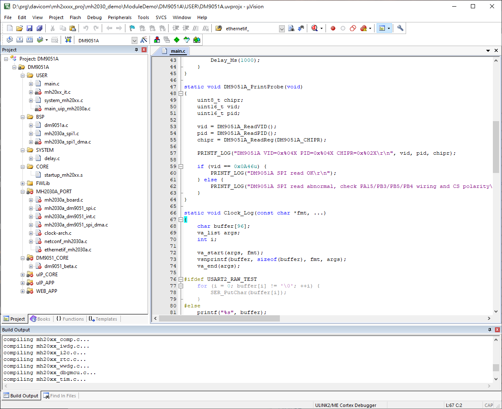
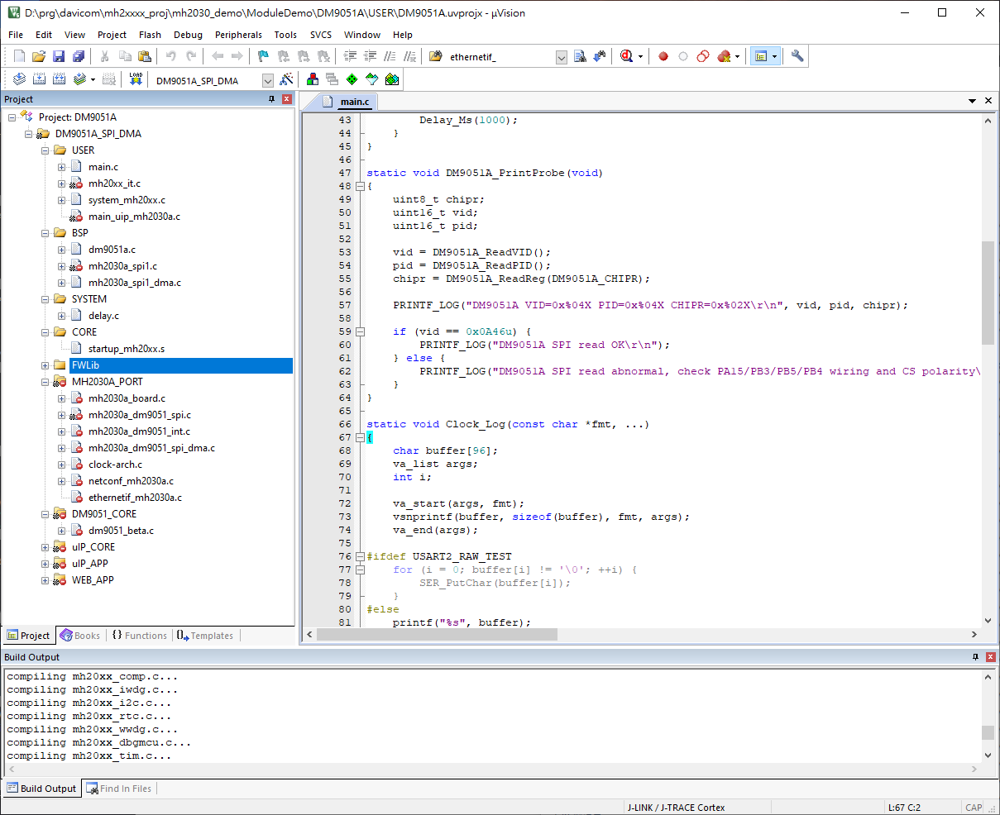
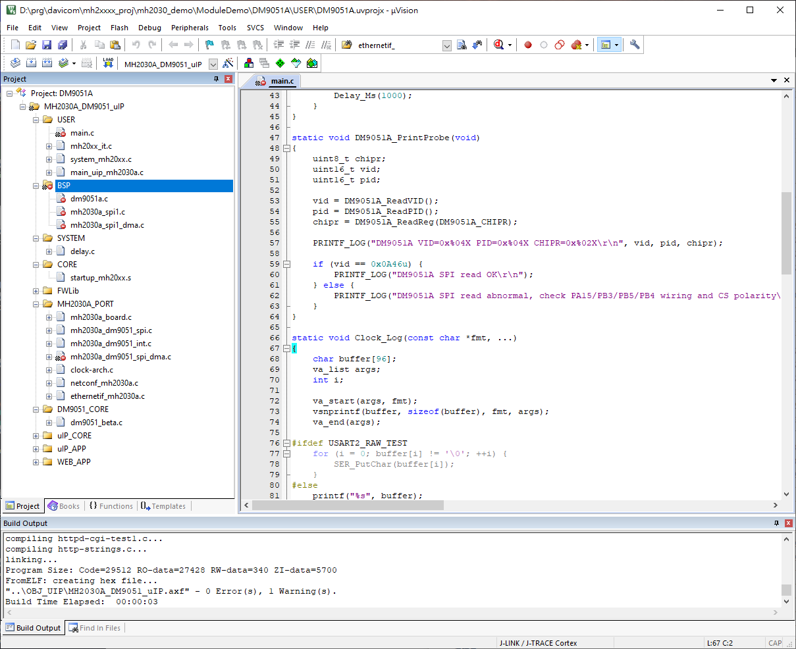
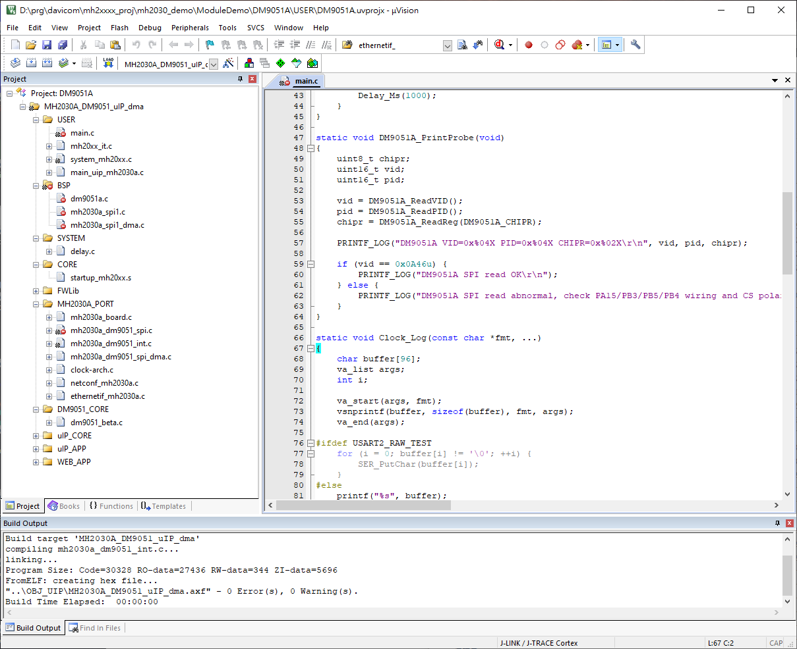
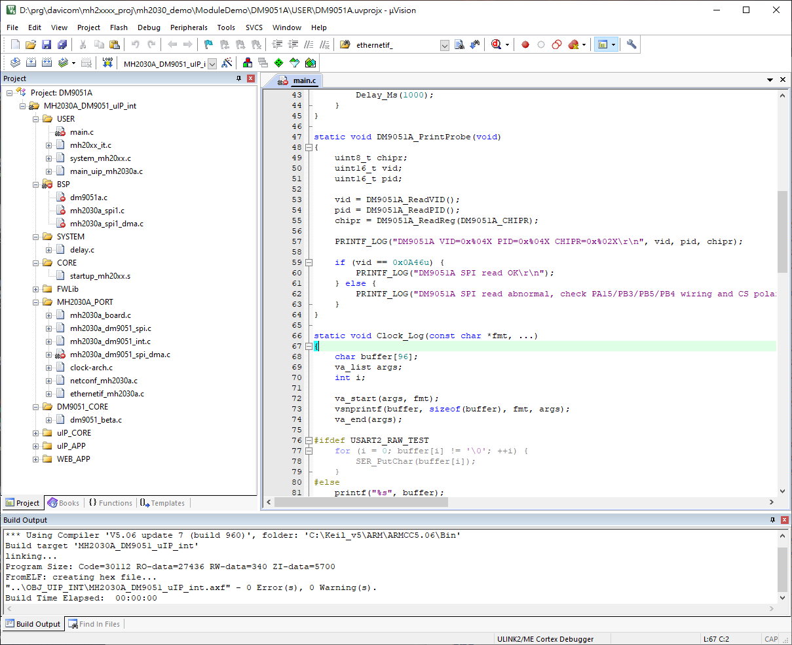
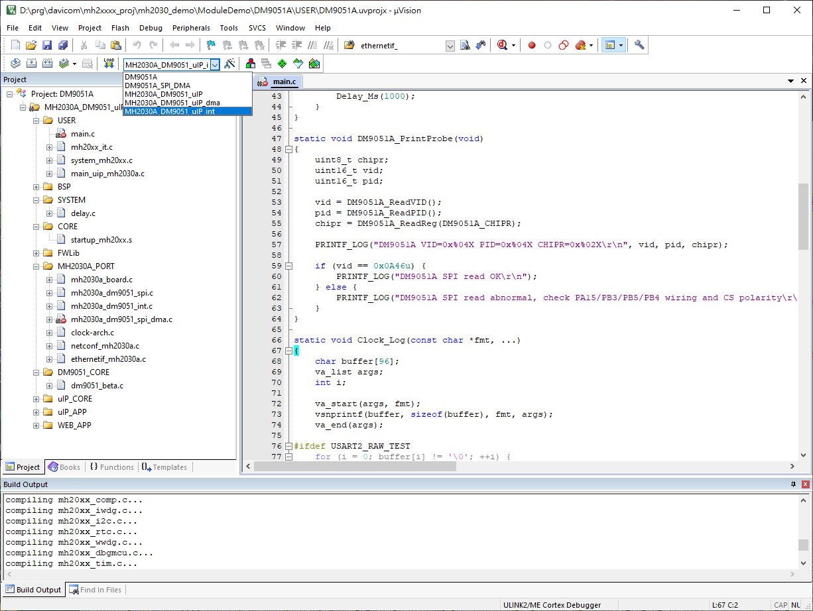

# MH2030A DM9051 Keil 專案工作內容報告

日期：2026-06-09  
分析目錄：`docs/mh2030a_proj`  
專案檔：`ModuleDemo/DM9051A/USER/DM9051A.uvprojx`

## 1. 目的

本報告整理 `docs/mh2030a_proj` 內的 Keil uVision 截圖，以及 `DM9051A.uvprojx` 專案設定。重點是確認目前 MH2030A + DM9051A 專案已建立多個 build target，可分別支援基本 SPI probe、SPI DMA，以及 uIP 網路範例的 polling、DMA、interrupt 版本。

## 2. 圖片盤點

| 圖片 | 畫面重點 | 判讀 |
| --- | --- | --- |
| `Snipaste_2026-06-09_16-44-39.png` | Keil 主畫面選中 `DM9051A` target | 基礎 DM9051A SPI probe target；Build Output 顯示已產生 hex，程式大小約 `Code=15852 RO-data=908 RW-data=52 ZI-data=1028`。 |
| `Snipaste_2026-06-09_16-49-10.png` | Keil 主畫面選中 `DM9051A_SPI_DMA` target | 基礎 DM9051A SPI DMA target；Build Output 同樣顯示已產生 hex，程式大小與前一張一致。 |
| `Snipaste_2026-06-09_16-49-30.png` | Keil 主畫面選中 `MH2030A_DM9051_uIP` target | uIP 一般版本；左側展開 `MH2030A_PORT`、`DM9051_CORE`、`uIP_CORE`、`uIP_APP`、`WEB_APP`。 |
| `Snipaste_2026-06-09_16-50-41.png` | Keil 主畫面選中 `MH2030A_DM9051_uIP_dma` target | uIP DMA 版本；專案群組與一般 uIP 版一致。 |
| `Snipaste_2026-06-09_16-50-56.png` | Keil 主畫面選中 `MH2030A_DM9051_uIP_int` target | uIP interrupt 版本；預期由 `DMPLUG_INT` 啟用中斷路徑。 |
| `Snipaste_2026-06-09_16-51-12.png` | Keil target 下拉清單 | 確認目前專案共有 5 個 target：`DM9051A`、`DM9051A_SPI_DMA`、`MH2030A_DM9051_uIP`、`MH2030A_DM9051_uIP_dma`、`MH2030A_DM9051_uIP_int`。 |

### 2.1 `DM9051A` target

此圖顯示 Keil 目前選中 `DM9051A` target，左側專案樹包含 `USER`、`BSP`、`SYSTEM`、`CORE`、`FWLib`、`MH2030A_PORT`、`DM9051_CORE`、`uIP_CORE`、`uIP_APP`、`WEB_APP` 等群組；下方 Build Output 顯示已進行編譯與 hex 產出。



### 2.2 `DM9051A_SPI_DMA` target

此圖顯示 Keil 選中 `DM9051A_SPI_DMA` target。畫面中的專案群組與基礎 `DM9051A` target 相同，Build Output 也顯示可完成編譯並建立 hex。



### 2.3 `MH2030A_DM9051_uIP` target

此圖顯示一般 uIP target。左側可看到 `MH2030A_PORT` 群組已展開，包含 board、SPI、interrupt stub、SPI DMA、clock、netconf、ethernetif 等 porting source。



### 2.4 `MH2030A_DM9051_uIP_dma` target

此圖顯示 uIP DMA target。從截圖看，專案群組與一般 uIP target 一致；目前差異主要需要由 target 名稱、輸出檔名，以及後續 file option 或條件編譯確認。



### 2.5 `MH2030A_DM9051_uIP_int` target

此圖顯示 uIP interrupt target。此 target 在 `.uvprojx` 中額外定義 `DMPLUG_INT`，對應 `mh2030a_dm9051_int.c` 內 PF6/EXTI6 interrupt 設定。



### 2.6 Target 下拉清單

此圖顯示 Keil target 下拉清單，確認目前可切換 5 個 target，涵蓋基礎 SPI probe、SPI DMA、uIP、uIP DMA、uIP interrupt。



## 3. Keil Target 設定摘要

| Target | OutputName | OutputDir | Define | 用途 |
| --- | --- | --- | --- | --- |
| `DM9051A` | `DM9051A` | `../OBJ/` | `USE_STDPERIPH_DRIVER` | 基礎 SPI probe，執行 `main.c`，確認 DM9051A VID/PID/CHIPR 讀取。 |
| `DM9051A_SPI_DMA` | `DM9051A_DMA` | `../OBJ/` | `USE_STDPERIPH_DRIVER` | 基礎 SPI DMA 版本；目前巨集與 include path 與 `DM9051A` 相同，實際差異需由檔案內條件編譯或 Keil file option 切換檔案。 |
| `MH2030A_DM9051_uIP` | `MH2030A_DM9051_uIP` | `../OBJ_UIP/` | `USE_STDPERIPH_DRIVER,MH2030A_UIP_PORT` | uIP + DM9051A polling/一般 bring-up。 |
| `MH2030A_DM9051_uIP_dma` | `MH2030A_DM9051_uIP_dma` | `../OBJ_UIP/` | `USE_STDPERIPH_DRIVER,MH2030A_UIP_PORT` | uIP + DM9051A DMA 版本；目前 target 巨集與一般 uIP 版相同。 |
| `MH2030A_DM9051_uIP_int` | `MH2030A_DM9051_uIP_int` | `../OBJ_UIP_INT/` | `USE_STDPERIPH_DRIVER,MH2030A_UIP_PORT,DMPLUG_INT` | uIP + DM9051A interrupt 版本；啟用 PF6/EXTI6 中斷處理。 |

共同設定：

- Device：`ARMCM0`
- Vendor：`ARM`
- CPU：`Cortex-M0`
- IROM：`0x00000000`，size `0x40000`
- IRAM：`0x20000000`，size `0x20000`
- Linker text address：`0x08000000`
- Linker data address：`0x20000000`
- Optimization：`1`
- Debug information：啟用
- Browse information：啟用
- Create HEX：啟用
- Scatter file：未指定

## 4. Include Path 差異

基礎 `DM9051A` / `DM9051A_SPI_DMA` include path：

```text
../SYSTEM/delay
../USER
../bsp
../../../Libraries/MH20xxLib/inc
../../../Libraries/CMSIS/Include
```

uIP target 額外加入：

```text
../port/uip_mh2030a
../../../middlewares/3rd_party/uip/inc
../../../middlewares/3rd_party/uip/port/at32f415_dm9051
../../../apps/uip_dm9051_example_e1/example_uip/inc
../../../apps/uip_dm9051_example_e1/uip_conf_inc
../../../apps/uip_dm9051_example_e1/uip_app_src
../../../apps/uip_dm9051_example_e1/uip_app_src/Eth_app/dhcpc
../../../apps/uip_dm9051_example_e1/uip_app_src/Eth_app/resolv
../../../apps/uip_dm9051_example_e1/uip_app_src/webserver/inc
../../../drivers/dm9051_edriver_v1.6.1a_beta
```

## 5. 專案群組與檔案構成

所有 target 目前都包含相同的主要群組：

- `USER`：`main.c`、`mh20xx_it.c`、`system_mh20xx.c`、`main_uip_mh2030a.c`
- `BSP`：`dm9051a.c`、`mh2030a_spi1.c`、`mh2030a_spi1_dma.c`
- `SYSTEM`：`delay.c`
- `CORE`：`startup_mh20xx.s`
- `FWLib`：MH20xx peripheral library，共 19 個 source
- `MH2030A_PORT`：MH2030A uIP porting layer，共 7 個 source
- `DM9051_CORE`：`dm9051_beta.c`
- `uIP_CORE`：`uip.c`、`uip_arp.c`、`timer.c`、`psock - EditA.c`
- `uIP_APP`：`uip-conf.c`、`app_call.c`、`debug_app.c`、`resolv.c`
- `WEB_APP`：`httpd.c`、`httpd-fs.c`、`httpd-cgi-test1.c`、`http-strings.c`

雖然所有 target 都列入相同群組，實際編譯入口與功能由巨集控制：

- `main.c` 外層使用 `#ifndef MH2030A_UIP_PORT`，只在非 uIP target 編譯主要 probe 流程。
- `main_uip_mh2030a.c` 是 uIP target 的主要入口，會執行 board init、tick init、network init、web init，並在主迴圈呼叫 `mh2030a_uip_net_loop()`。
- `mh2030a_dm9051_int.c` 使用 `#if defined(DMPLUG_INT)` 切換 interrupt/polling 行為。

## 6. 主要功能路徑

### 6.1 基礎 DM9051A SPI Probe

`DM9051A` target 由 `main.c` 啟動：

1. 初始化 clock，目標為 HSI/2 + PLL x18，輸出 72 MHz。
2. 初始化 delay 與 USART2，baud rate 為 115200。
3. 印出 clock 與腳位資訊。
4. 呼叫 `DM9051A_Init()`。
5. 讀取 `VID`、`PID`、`CHIPR`。
6. 若 `VID == 0x0A46`，輸出 `DM9051A SPI read OK`；否則提示檢查 PA15/PB3/PB5/PB4 wiring 與 CS polarity。

截圖中顯示的腳位提示：

```text
PA15 CS(GPIO)
PB3  SCK
PB5  MOSI
PB4  MISO
```

### 6.2 uIP Bring-up

`MH2030A_DM9051_uIP*` target 由 `main_uip_mh2030a.c` 啟動：

1. `mh2030a_uip_board_init(115200)`
2. `mh2030a_uip_tick_init()`
3. 印出 `[MH2030A uIP] DM9051 + uIP bring-up`
4. `mh2030a_uip_net_init()`
5. 若 `WEB_EN` 啟用，呼叫 `httpd_init()`
6. 進入 while loop，持續呼叫 `mh2030a_uip_net_loop()`

### 6.3 Interrupt 版本

`MH2030A_DM9051_uIP_int` target 額外定義 `DMPLUG_INT`。在 `mh2030a_dm9051_int.c` 中，interrupt 設定如下：

- INT port：`GPIOF`
- INT pin：`PF6`
- EXTI line：`EXTI_Line6`
- IRQ：`EXTI4_15_IRQn`
- Trigger：falling edge
- Pull：GPIO pull-up

中斷服務流程：

1. `EXTI4_15_IRQHandler()` 檢查 `EXTI_Line6` pending。
2. 呼叫 `dm9051_interrupt_set(DM9051_INT_LINE)` 通知 DM9051 driver。
3. 清除 EXTI pending bit。

若未定義 `DMPLUG_INT`，同一檔案會回傳 interrupt disabled/polling mode 的 stub 行為。

## 7. 目前觀察到的工作成果

- 已在 Keil 專案中建立 5 個可選 target，並可由下拉清單切換。
- 已把 MH2030A uIP porting layer、DM9051 driver、uIP core、uIP app、web app 加入專案群組。
- uIP target 已加入完整 include path，涵蓋 middleware、app source、webserver include、DM9051 beta driver。
- `MH2030A_UIP_PORT` 已用來區分基礎 SPI probe 與 uIP bring-up。
- `DMPLUG_INT` 已用來隔離 interrupt 版本，且 interrupt 腳位配置為 PF6/EXTI6。
- 截圖顯示基礎 `DM9051A` 與 `DM9051A_SPI_DMA` target 已能 build 並產生 hex。
